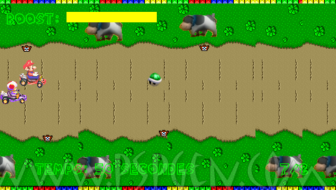

Mario Kart (v3)
===========

Small homebrew game written in Lua for PSP 

##What's this ?
A minimalistic kart racing simulation.

##Notes
Compatible with 1.50, 3.XX and 4.XX Kernels.  
Should work on PSP Slim and Fat (Uses *LPHM 7*).

##Installation Path
ms0:/PSP/GAME/

##License
* *Code* : The MIT License (MIT). Copyright (c) 2008 Roland Y. See [LICENSE](license).
* *Sprites* : Copyright (c) 2008 JOY6679. Copyright (c) 2008 The Spriter's Resource.

